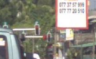
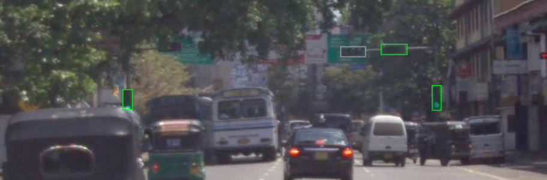
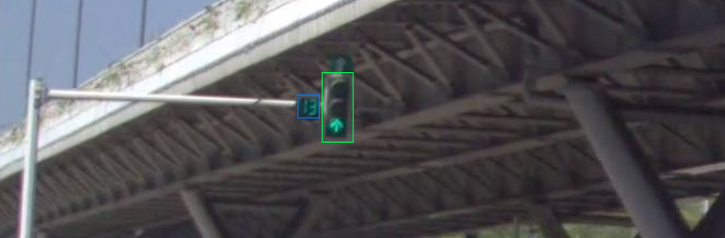
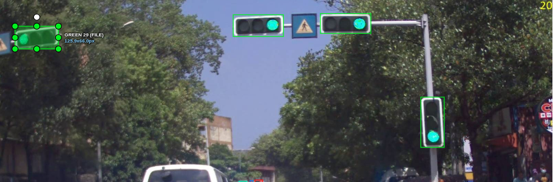

# Annotation Guideline — Traffic Light Detection
Version: v4-draft

---

## 1. Mục tiêu

Gán nhãn **đèn tín hiệu giao thông dành cho phương tiện** và **trạng thái đang hiển thị** của chúng.

Downstream là model phát hiện đèn và phân loại trạng thái từ camera gắn trên xe. Nghĩa là: **sai tín hiệu dừng/đi
nghiêm trọng hơn sai một box đèn tắt.** Khi phải đánh đổi thời gian, ưu tiên làm đúng đèn đang sáng.

Mỗi ảnh được gán nhãn độc lập.

---

## 2. Đối tượng cần gán nhãn

### Vẽ box

- Đèn tín hiệu dành cho xe, dạng **dọc** hoặc **ngang**.
- Đèn tín hiệu dạng **mũi tên**.
- Đèn tín hiệu đang tắt nhưng **vẫn tách được ranh giới mặt bóng** (xem ngưỡng ở mục 3).
- **Bộ đếm ngược** cạnh đèn giao thông.
- Đèn của các hướng/làn khác nếu vẫn nhìn thấy rõ trong ảnh.

### Không vẽ box

- Đèn người đi bộ.
- Mặt sau hoặc mặt hông của đèn khi không nhìn thấy mặt bóng.
- Biển báo và biển chỉ hướng.
- Cột, cần vươn, giá đỡ, dây treo.
- Đèn đường, đèn xe, đèn công trường hoặc đèn cảnh báo.
- Phản chiếu của đèn trên kính, xe hoặc mặt đường.
- Đèn xuất hiện trong biển quảng cáo, màn hình hoặc hình ảnh khác.
- 🆕 Khối tối nghi là đèn nhưng **không tách được bóng nào** (xem mục 3).

---

## 3. 🆕 Ngưỡng "nhìn thấy mặt bóng"

**Đây là rule gây sai nhiều nhất và là lý do chính tồn tại bản v4.**

Nếu vật chỉ hiện ra như một **khối tối hoặc khối chữ nhật mờ** mà bạn không chỉ được đâu là bóng thứ nhất, đâu là bóng
thứ hai → **KHÔNG vẽ**.

**Không được dùng `Empty` làm chỗ chứa cho "tôi không đọc được".** `Empty` chỉ dành cho trường hợp bạn **thấy rõ mặt
bóng** và xác định được rằng **không bóng nào đang sáng**. Hai việc đó khác nhau.

| Bạn thấy | Làm gì |
|---|---|
| Tách được bóng, có bóng sáng | Vẽ, chọn class theo màu/hình bóng sáng |
| Tách được bóng, không bóng nào sáng | Vẽ, class `Empty` |
| Không tách được bóng nào | **Không vẽ** |
| Không chắc mình có tách được hay không | Vẽ, class khả dĩ nhất, `needs_review = true`, ghi lý do vào `note` |

---

## 4. Quy tắc vẽ bounding box

### Đơn vị annotation

**Một box = một vỏ đèn giao thông (housing).**

Không vẽ riêng từng bóng đỏ, vàng, xanh trong cùng một vỏ đèn.

- Một vỏ có 3 bóng, hiện đang sáng đỏ → **1 box**, class `Red`.
- Một cụm có vỏ đèn và bộ đếm ngược → vẽ **2 box riêng**.

### Cách vẽ box

- Dùng **Rectangle / Shape** trong CVAT.
- Box ôm sát **toàn bộ phần vỏ đèn nhìn thấy được**.
- Bao gồm cả các bóng đang tắt nằm trong cùng vỏ.
- Bao gồm phần che nắng nếu thuộc thân đèn.
- Không bao gồm cột, cần vươn, dây, giá đỡ hoặc biển báo.
- Không để khoảng trống dư quanh object.

### 🆕 Ngưỡng geometry đo được

> **Mỗi cạnh của box được lệch tối đa 2 px** so với ranh giới vỏ đèn nhìn thấy.

Vượt ngưỡng, hoặc bao lấn cột / cần vươn / giá đỡ / biển báo → **không đạt geometry**.

### Bộ đếm ngược

Bộ đếm ngược là một object riêng. Box chỉ bao quanh **phần hiển thị số**, không bao gồm giá treo hoặc bộ phận hỗ trợ.

---

## 5. Labels

| Label | Khi sử dụng |
|---|---|
| `Red` | Đèn đỏ tròn đang sáng |
| `Yellow` | Đèn vàng tròn đang sáng |
| `Green` | Đèn xanh tròn đang sáng |
| `Red-Yellow` | Đỏ và vàng **cùng** sáng |
| `Green-up` | Đèn xanh hình mũi tên ↑ |
| `Green-left` | Đèn xanh hình mũi tên ← |
| `Green-right` | Đèn xanh hình mũi tên → |
| `Empty` | Thấy rõ mặt bóng nhưng không bóng nào sáng |
| `Count-down` | Bộ đếm ngược **đang hiển thị số** |
| `Empty-count-down` | Bộ đếm ngược **không hiển thị số** |

## 6. 🆕 Attribute

Ba attribute dưới đây **phải có trong `03_cvat_labels.json`**, gán được cho mọi class.

| Attribute | Kiểu | Default | Dùng khi |
|---|---|---|---|
| `needs_review` | checkbox | `false` | Không chắc class, không chắc hướng mũi tên, không chắc có phải đèn xe. Đây là **đường escalation duy nhất nhìn thấy được trong file export**. |
| `truncated` | checkbox | `false` | Object bị mép ảnh cắt. |
| `note` | text | rỗng | Bắt buộc điền khi `needs_review = true`: ghi bạn không chắc điều gì. |

---

## 7. Cách chọn class

Thực hiện theo thứ tự:

### Bộ đếm ngược

- Có hiển thị số → `Count-down`
- 🆕 Không hiển thị số, **nhưng nhận ra được khung/viền đặc trưng của bộ đếm trong cụm đèn** → `Empty-count-down`
- 🆕 Không hiển thị số và **không nhận ra đó là bộ đếm hay vật khác** → **không vẽ**

### Đèn giao thông

Không tách được ranh giới bóng nào → **không vẽ** (mục 3).

Tách được ranh giới bóng:

- Không có bóng sáng → `Empty`
- **Đỏ + vàng cùng sáng → `Red-Yellow`** ← kiểm tra trước khi chọn `Red`
- Đỏ sáng → `Red`
- Vàng sáng → `Yellow`
- Xanh tròn → `Green`
- Xanh mũi tên ↑ → `Green-up`
- Xanh mũi tên ← → `Green-left`
- Xanh mũi tên → → `Green-right`

**Không xác định trạng thái dựa vào vị trí của bóng trong vỏ đèn.** Luôn dựa vào **màu và hình dạng của bóng đang sáng**.

### 🆕 `Red-Yellow` hay `Red`

Đây là lỗi **critical** duy nhất thoát ra trong blind test, nên nó có mục riêng.

Trước khi chọn `Red`, **luôn kiểm bóng ngay dưới bóng đỏ**. Nếu cả hai cùng sáng → `Red-Yellow`. Ở đèn nhỏ hoặc xa,
hai bóng sáng dễ nhoè vào nhau thành một vệt — zoom lên trước khi chốt.

**Bằng chứng:** `wide_t2_376` — gold có 3 `Red-Yellow`, annotator thứ hai chỉ vẽ 2 và đọc 1 cái thành `Red`. Hai trong
ba box chỉ rộng **7–8px**. Ở v3, mục "các lỗi cần tránh" đã ghi đúng câu *"nhầm `Red-Yellow` thành `Red`"* bằng chữ mà
lỗi vẫn xảy ra — nên lần này rule có ví dụ hình và bước kiểm cụ thể.

---

## 8. Quy tắc đối với mũi tên

Hướng mũi tên được xác định theo **hình mũi tên nhìn thấy trong ảnh**.

- ↑ → `Green-up`
- ← → `Green-left`
- → → `Green-right`
- ↖ → `Green-left`
- ↗ → `Green-right`

Nếu hướng mũi tên không xác định rõ → vẫn vẽ, chọn khả dĩ nhất, `needs_review = true`, ghi `note`.

---

## 9. Đèn bị che hoặc bị cắt

### Bị che

Nếu vẫn nhìn thấy bóng đang sáng và xác định được trạng thái:

- Vẫn vẽ box.
- Box chỉ bao phần vỏ **thực sự nhìn thấy**.
- Không tự đoán phần bị che.

Nếu bị che quá nhiều và không đủ thông tin để xác định object/trạng thái → **không vẽ**.

🆕 Nếu đọc được nhưng không chắc → vẽ, `needs_review = true`, `note` ghi bị che bao nhiêu.

### Bị cắt bởi mép ảnh

- Box dừng tại mép ảnh.
- Không kéo box ra ngoài ảnh.
- Không tự đoán phần nằm ngoài ảnh.
- Gán `truncated = true`.
- Nếu phần còn nhìn thấy đủ để xác định trạng thái → chọn class tương ứng.

---

## 10. Ảnh mờ, loá hoặc khó xác định

Nếu vẫn xác định được màu/hình của bóng → gán class bình thường.

Nếu không chắc chắn:

- Vẫn vẽ box nếu xác định được đó là đèn giao thông.
- Chọn class khả dĩ nhất.
- `needs_review = true`, ghi lý do vào `note`.

Các trường hợp thường cần review:

- Không phân biệt được đỏ/vàng.
- Không rõ object là đèn hay biển báo.
- Không rõ hướng mũi tên.
- Không chắc là đèn xe hay đèn người đi bộ.
- Vỏ đèn có cấu trúc bất thường.
- 🆕 Đèn rất nhỏ (dưới ~15px cạnh ngang) mà vẫn nghĩ là đọc được trạng thái.

---

## 11. 🆕 Đèn nhỏ và ở xa

Ba trong bốn lỗi nặng nhất của buổi calibration + blind test nằm ở object rộng **7–35px**. Nên nhóm này có rule riêng.

- Zoom lên tối thiểu 200% trước khi chốt class cho object rộng dưới 25px.
- Không hạ một đèn đang sáng xuống `Empty` chỉ vì nó nhỏ. Bóng sáng ở xa trông nhạt màu, không phải là tắt.
- Nếu zoom rồi vẫn không chắc → `needs_review = true`.

**Bằng chứng:** `narrow_t2_382`, đèn 13×35px. Hai annotator vẽ box **gần trùng khít** —
`x[600-613] y[367-402]` và `x[600-614] y[367-402]` — nhưng một người đọc `Green`, người kia đọc `Empty`. Không ai bỏ
sót; họ chỉ đọc trạng thái khác nhau.

---

## 12. Quy tắc ảnh narrow / wide

Ảnh `narrow_*` và `wide_*` có thể là cùng một cảnh từ hai camera khác nhau.

**Phải gán nhãn từng ảnh độc lập.** Không copy bounding box hoặc class từ ảnh camera kia nếu thông tin không nhìn thấy
rõ trong ảnh đang annotate.

🆕 Khung `wide` thường làm đèn nhỏ hơn và mờ hơn. Cùng một đèn có thể **đạt** ngưỡng mục 3 ở ảnh `narrow` và **không
đạt** ở ảnh `wide`. Đó là kết quả đúng, không phải mâu thuẫn cần sửa.

---

## 13. Các lỗi cần tránh

- Chỉ box bóng đang sáng thay vì toàn bộ vỏ đèn.
- Tách từng bóng trong cùng một vỏ thành nhiều box.
- Box lẫn cột, cần vươn hoặc biển báo.
- Gán nhãn đèn người đi bộ.
- Gán nhãn mặt sau của đèn.
- Đoán trạng thái dựa vào vị trí bóng.
- Nhầm `Red-Yellow` thành `Red`.
- Nhầm `Green` với các class mũi tên.
- Quên annotate bộ đếm ngược.
- Quên `Empty-count-down`.
- Vẽ box ra ngoài mép ảnh.
- Copy annotation giữa ảnh `narrow` và `wide`.
- 🆕 Dùng `Empty` cho vật không tách được bóng — `Empty` không phải nhãn "không đọc được".
- 🆕 Hạ một đèn đang sáng xuống `Empty` vì nó nhỏ hoặc nhạt màu.
- 🆕 Vẽ "ôm sát bằng cảm giác" mà không kiểm ngưỡng 2px.
- 🆕 Bỏ trống `note` khi đã bật `needs_review`.

---

## 14. Checklist trước khi hoàn thành ảnh

1. Đã quét hết ảnh, kể cả các đèn ở xa và sát mép chưa?
2. Mỗi vỏ đèn chỉ có **1 box** chưa?
3. Bộ đếm ngược đã được vẽ box riêng chưa?
4. Box có lẫn cột, cần hoặc biển báo không?
5. Đỏ + vàng cùng sáng đã dùng `Red-Yellow` chưa? Đã kiểm bóng dưới bóng đỏ chưa?
6. Object bị cắt mép đã gán `truncated` chưa?
7. Có gán nhầm đèn người đi bộ hoặc mặt sau đèn không?
8. Các trường hợp không chắc đã bật `needs_review` **và** điền `note` chưa?
9. 🆕 Mọi object `Empty` đều thực sự **thấy rõ mặt bóng** chứ không phải khối tối chưa?
10. 🆕 Object rộng dưới 25px đã zoom ≥ 200% để kiểm class chưa?
11. 🆕 Các cạnh box đã trong ngưỡng 2px chưa?

---
